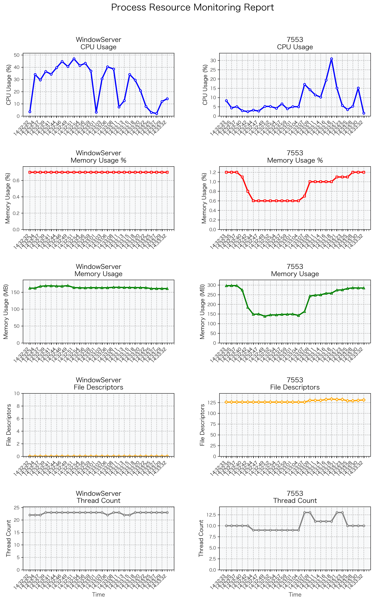

# 通用进程监控系统

一个进程监控解决方案，支持通过进程名或PID监控单个或多个进程，提供实时监控、数据存储、可视化分析和性能报告生成功能。所有功能都集成在单个脚本文件中，使用简单，功能强大。目前主要用于测试报告生成。

## 🚀 快速开始

### 1️⃣ 基本监控

```bash
# 监控单个进程（最简单的方式）
python3 process_monitor.py --monitor --targets systemd --duration 60 --interval 5

# 监控多个进程（混合进程名和PID）
python3 process_monitor.py --monitor --targets systemd python3 1234 --duration 60 --interval 5
```

### 2️⃣ 生成可视化图表

```bash
# 监控并生成图表（推荐：自动保存到report目录）
python3 process_monitor.py --monitor --targets systemd --duration 30 --interval 2 --visualize --no-show

# 从已有数据生成图表
python3 process_monitor.py --load-data process_monitor_data_20250905_180928.json --visualize --no-show
```

### 3️⃣ 生成性能报告

```bash
# 一键生成完整的性能测试报告
python3 process_monitor.py --monitor --duration 30 --interval 2 --targets systemd --generate-report

# 从已有数据生成报告
python3 process_monitor.py --data-file process_monitor_data_20250905_180928.json --report-output performance_report.md
```

### 4️⃣ 启用高级监控指标

```bash
# 启用文件描述符监控
python3 process_monitor.py --monitor --targets python3 --enable-file-descriptors --interval 2 --duration 30

# 启用线程数监控
python3 process_monitor.py --monitor --targets python3 --enable-thread-count --interval 2 --duration 30
```

### 💡 推荐使用方式

**最简单的完整监控流程**：

```bash
# 一步完成：监控 + 可视化 + 报告生成（推荐）
python3 process_monitor.py --monitor --enable-thread-count --enable-file-descriptors --interval 1 --visualize --generate-report --no-show --duration 10 --targets systemd
```

**结果文件位置**：

- 监控数据：`report/001_20250101_120000/monitor_data_*.json`
- 可视化图表：`report/001_20250101_120000/performance_chart.png`
- 性能报告：`report/001_20250101_120000/performance_report.md`

## 📋 系统组件

| 脚本文件 | 功能描述 | 使用场景 |
|----------|----------|----------|
| `process_monitor.py` | **一体化进程监控系统** | **唯一脚本** - 包含所有功能 |
| `install_matplotlib.sh` | matplotlib安装脚本 | 环境配置（可选） |

## 🎯 核心功能

- ✅ **通用监控** - 通过进程名或PID监控任何进程
- ✅ **多进程支持** - 同时监控多个进程，支持混合模式
- ✅ **实时监控** - 实时显示CPU和内存使用情况
- ✅ **扩展监控** - 支持文件描述符、线程数等高级指标
- ✅ **灵活配置** - 可选择性启用/禁用各种监控指标
- ✅ **数据存储** - 以JSON格式保存监控数据
- ✅ **可视化图表** - 生成专业的监控报告
- ✅ **智能时间轴** - 自动优化时间点显示
- ✅ **性能报告** - 生成详细的性能测试报告
- ✅ **有序报告** - 自动创建带序列号的报告目录结构
- ✅ **一体化设计** - 所有功能集成在单个脚本中，无需额外文件

## 📊 监控指标

### 默认监控项（始终启用）

- **CPU使用率** - 进程CPU使用百分比
- **内存使用率** - 进程内存使用百分比
- **内存使用量** - 进程实际内存使用量（MB）
- **系统负载** - 系统1分钟平均负载
- **进程信息** - PID、命令名、运行时间等

### 可选监控项

- **文件描述符** - 进程当前打开的文件描述符数量
- **线程数** - 进程当前线程数量

## 🛠️ 安装和配置

### 基本环境

```bash
# 检查Python版本（需要Python 3.6+）
python3 --version

# 安装基本依赖（可选）
pip3 install -r monitor_requirements.txt
```

### 可视化支持（可选）

```bash
# 安装matplotlib
./install_matplotlib.sh
```

## 📖 详细使用说明

### process_monitor.py 参数说明

#### 监控相关参数

| 参数 | 功能 | 示例 |
|------|------|------|
| `--monitor` | 开始监控模式 | `--monitor` |
| `--targets` | 要监控的进程名或PID列表 | `--targets systemd python3 1234` |
| `--duration` | 监控持续时间（秒） | `--duration 60` |
| `--interval` | 采样间隔（秒） | `--interval 5` |
| `--visualize` | 生成可视化图表 | `--visualize` |
| `--output` | 图表输出文件路径（可选，默认保存到report目录） | `--output report.png` |
| `--no-show` | 不显示图表，只保存 | `--no-show` |
| `--load-data` | 从JSON文件加载数据 | `--load-data data.json` |
| `--summary` | 显示监控摘要 | `--summary` |
| `--generate-report` | 生成性能测试报告 | `--generate-report` |

#### 报告生成参数

| 参数 | 功能 | 示例 |
|------|------|------|
| `--data-file` | 监控数据JSON文件路径 | `--data-file data.json` |
| `--report-output` | 报告输出文件路径 | `--report-output report.md` |
| `--report-dir` | 报告目录路径 | `--report-dir ./reports` |
| `--version` | 工具版本信息 | `--version v1.0` |

#### 监控配置参数

| 参数 | 功能 | 示例 |
|------|------|------|
| `--enable-file-descriptors` | 启用文件描述符监控 | `--enable-file-descriptors` |
| `--enable-thread-count` | 启用线程数监控 | `--enable-thread-count` |
| `--disable-cpu` | 禁用CPU监控 | `--disable-cpu` |
| `--disable-memory` | 禁用内存监控 | `--disable-memory` |

## 📁 项目结构

```plain
monitor/
├── README.md                    # 主要文档（本文件）
├── process_monitor.py          # 一体化进程监控系统（唯一脚本）
├── install_matplotlib.sh       # matplotlib安装脚本（可选）
├── monitor_requirements.txt    # Python依赖文件（可选）
├── report/                     # 报告目录（自动创建）
│   └── 001_20250101_120000/   # 序列化报告目录
│       ├── monitor_data_*.json # 监控数据
│       ├── performance_chart.png # 可视化图表（自动生成）
│       └── performance_report.md # 性能测试报告
```

## 📂 文件保存机制

### 自动目录管理

- **报告目录**: 系统会自动创建带序列号的报告目录（如 `001_20250101_120000/`）
- **图表保存**: 使用 `--visualize` 时，图表默认保存为 `report/XXX_时间戳/performance_chart.png`
- **数据保存**: 监控数据自动保存为 `report/XXX_时间戳/monitor_data_时间戳.json`
- **报告生成**: 性能报告保存为 `report/XXX_时间戳/performance_report.md`

### 自定义保存路径

- 使用 `--output` 参数可指定图表保存路径
- 使用 `--save-data` 参数可指定数据保存路径
- 不指定路径时，所有文件都会自动保存到对应的报告目录中

## ⚡ 性能建议

- **监控频率**: 建议采样间隔 ≥ 5秒，避免影响系统性能
- **进程数量**: 多进程监控建议不超过10个进程
- **图表显示**: 可视化建议不超过5个进程
- **长期监控**: 使用较大的采样间隔（30+秒）

## 🔧 故障排除

### 常见问题

- **进程未找到**: 使用 `ps aux | grep monitor` 检查进程状态
- **权限不足**: 使用 `sudo` 运行监控脚本
- **图表显示问题**: 使用 `--no-show` 参数只保存图片
- **报告生成问题**: 确保数据文件存在于报告目录中
- **进程不存在**: 系统会显示零值而不是错误
- **监控项无数据**: 某些监控项在某些系统上可能返回零值

## 📊 图表样例



## 🤝 贡献

欢迎提交Issues和Pull Requests来改进这个项目。

---

**`process_monitor.py` 是唯一需要的脚本文件，集成了所有功能：进程监控、数据存储、可视化分析和性能报告生成。**
